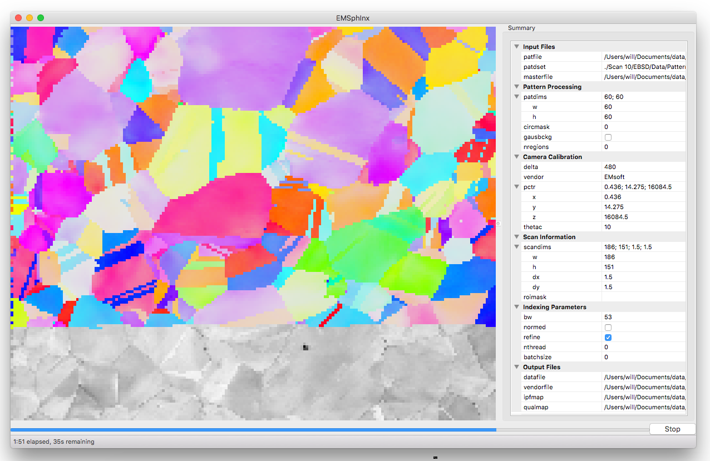
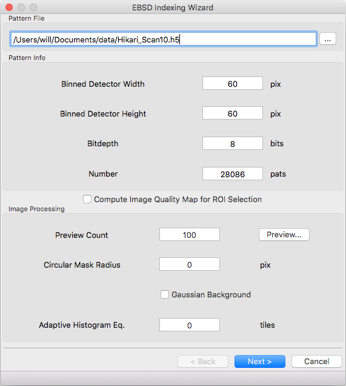
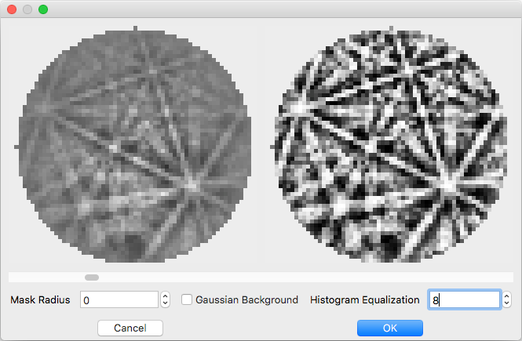
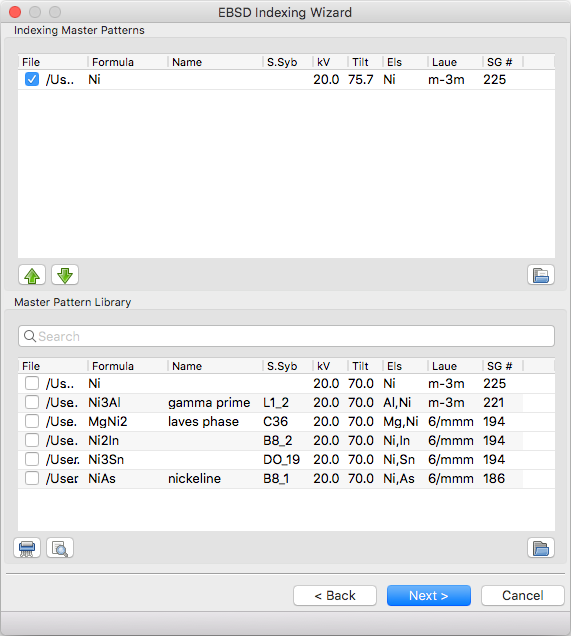
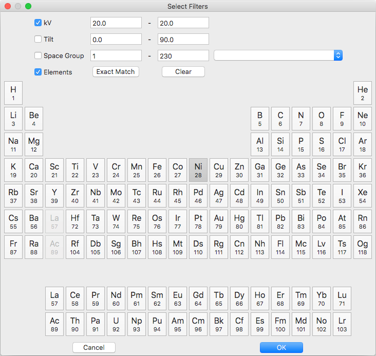
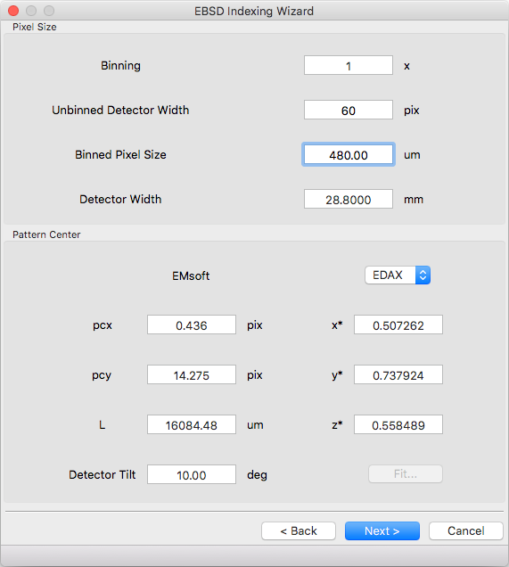
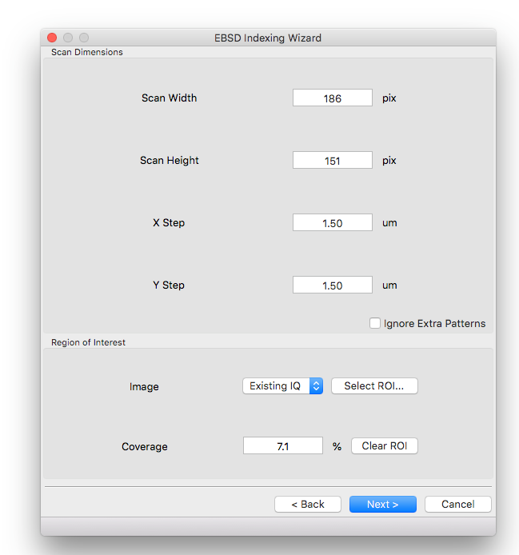
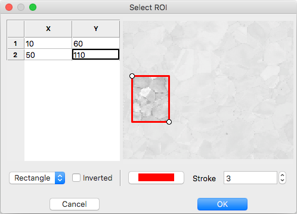
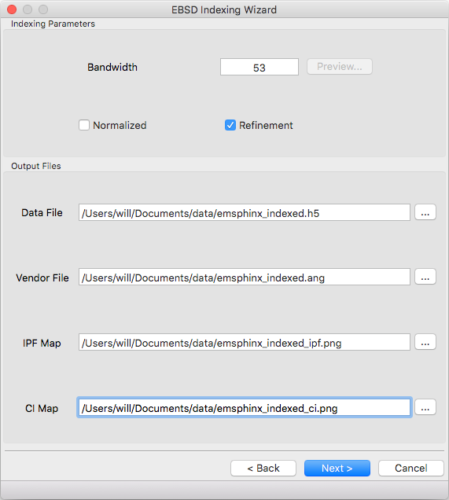
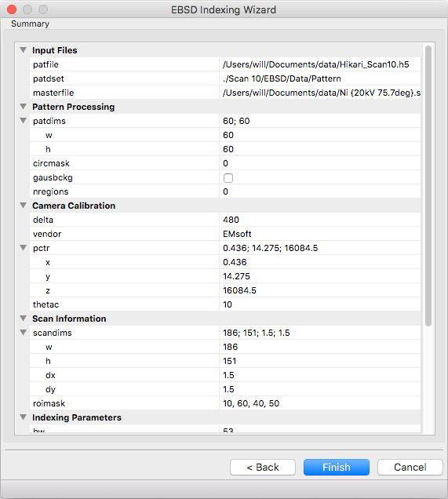

EMSphInxEBSD
==================================================

EMSphInxEBSD is a GUI for indexing EBSD patterns using spherical harmonics, part of the `EMSphInx`_ package.

.. _EMSphInx: https://github.com/EMsoft-org/EMSphInx

Main Window
------------------------------------

The main window consists of a menu bar (top), live indexing result (left), indexing parameters (right), and progress/status bar (bottom). To index an EBSD scan first specify the parameters by editing the summary panel directly, loading a namelist file, and/or using the wizard (Menu |tri| File |tri| Wizard). Once the parameters are specified hit the 'Start' button and indexing will begin. 

Indexer initialization may take several minutes on the first run as Fourier transforms are being planned. To preplan DFTs use Menu |tri| Edit |tri| FFT Wisdom |tri| Build Wisdom.

The main window is split into 3 primary sections as seen in the screenshot below: live indexing result (left), `Parameter Summary Panel`_ (right), and status bar (bottom)

.. |tri| unicode:: U+25B6 .. right triangle

Menu Bar
~~~~~~~~~~~~~~~~~~~~~~~~~~~~~~~~~~~~

File Menu
************************************

============= ==============================================================
**Item**      **Function**
Open...       load indexing parameters from a namelist (.nml) file
Save...       save current indexing parameters from a namelist (.nml) file
Wizard...     build indexing parameters interactively using the wizard (the wizard will be prepopulated with current values if possible)
============= ==============================================================

Tools Menu
************************************

============================ ==============================================================
**Item**                     **Function**
Clear Wisdom                 delete any accumulated wisdom, see `FFTW Words of Wisdom`_ for details about FFT wisdom
Build Wisdom...              plan DFTs sizes needed for specified bandwidths
Import Wisdom...             load DFT plan wisdom from a file (adds to existing wisdom)
Export Wisdom...             export DFT plan wisdom to a file
Convert Master Pattern...    convert from EMsoft *.h5 master pattern format to EMSphInx *.sht format
Extract Master Projection... extract a stereographic master pattern projection from a *.sht file
============================ ==============================================================

Please note that wisdom is hardware specific and for best performance shouldn't be shared between platforms. 

Help Menu
************************************

================ ==============================================================
**Item**         **Function**
About...         display information about this program
Citations...     display relevant citations - both for this program and for any currently selected master patterns
Help...          link to this documentation
================ ==============================================================

Parameter Summary Panel
~~~~~~~~~~~~~~~~~~~~~~~~~~~~~~~~~~~~
The parameter summary panel is split into 6 sections detailed below: 

#. Input files - EBSD pattern source and simulated master pattern 
#. Pattern Processing - pattern size and image preprocessing 
#. Camera Calibration - detector geometry description 
#. Scan Information - orientation map dimensions and region of interest 
#. Indexing Parameters - spherical cross correlation and threading parameters 
#. Output Files - locations to save indexing results 

If you are uncomfortable filling parameters directly, use the wizard. 

Input Files
************************************

================ ============= =========================================
**Name**         **Type**      **Value**
patfile          file          EBSD patterns to index (*.up1,* .up2, *.ebsp, or* .h5)
patdset          string        path to patterns within hdf5 file (ignored for other formats)
masterfile       file list     spherical master pattern files to index against (.sht), first file is phase 0 in output, second file is phase 1, etc.
================ ============= =========================================

Pattern Processing
************************************

============= ============ ===============================================
**Name**      **Type**     **Value**
patdims.w     integer      width of detector in pixels
patdims.h     integer      height of detector in pixels
circmask      integer      circular mask radius (-1 for no mask, 0 for inscribed circle, >0 for radius in pixels)
gausbckg      boolean      should a 2D Gaussian background be subtracted from patterns
nregions      integer      number of tiles for `adaptive histogram equalization`_ (0 for no equalization)
============= ============ ===============================================

.. _adaptive histogram equalization: https://doi.org/10.1016/S0734-189X(87)80186-X

Camera Calibration
************************************

+----------+-----------+-----------------------------------------------------------------------------------------------+
| **Name** |  **Type** | **Value**                                                                                     |
+----------+-----------+-----------------------------------------------------------------------------------------------+
| delta    | real      | detector pixel size in microns (i.e. patdims.w * delta is the width of the detector)          |
+----------+-----------+-----------------------------------------------------------------------------------------------+
| vendor   | enum      | pattern center convention (EMsoft, Bruker, EDAX, or Oxford)                                   |
+----------+-----------+-----------------------------------------------------------------------------------------------+
| pctr.x   | real      |                                                                                               |
+----------+-----------+ pattern center calibration, see table below or refer                                          |
| pctr.y   | real      | to the `EMsoft tutorial paper`_ for details                                                   |
+----------+-----------+                                                                                               |
| pctr.z   | real      |                                                                                               |
+----------+-----------+-----------------------------------------------------------------------------------------------+
| theatc   | real      |camera elevation angle in degrees, refer to the `EMsoft EBSD forward model paper`_ for details |
+----------+-----------+-----------------------------------------------------------------------------------------------+

.. _EMsoft tutorial paper: https://doi.org/10.1184/R1/7792505
.. _EMsoft EBSD forward model paper: https://doi.org/10.1017/S1431927613001840

Pattern Center Conventions:

======== ========== ================ =============== ================
**Name** **EMsoft** **Bruker**       **EDAX**        **Oxford**
pctr.x   pixels     detector widths  detector widths detector widths
pctr.y   pixels     detector widths  detector widths detector heights
pctr.z   microns    detector heights detector widths detector widths
origin   center     top left         bottom left     bottom left
======== ========== ================ =============== ================

Scan Information
************************************

=============== ============ ===================================================================================
**Name**        **Type**     **Value**
scandims.w      integer      width of scan grid in pixels
scandims.h      integer      height of scan grid in pixels
scandims.dx     real         width of grid pixel in microns
scandims.dy     real         height of grid pixel in microns
roimask         string\*     string representation of region of interest to index (or empty to index everything)
=============== ============ ===================================================================================

The ROI string is a series of (x,y) image coordinates (integer pixels)
with 3 shapes defined:

#. Rectangle - first coordinate is origin, second coordinate is rectangle size
#. Ellipse - 'e' + bounding box as rectangle
#. Polygon - vertices in order (first/last point specified twice)

The region of interested can be inverted (the excluded region selected
instead of the included region) by prepending the string with 'i'. Here
are some ROI string examples:

-  only points inside the rectangle with corners at (12, 34) and (56,
   79) - "12, 34, 44, 45"
-  the same rectangle specified as a polygon - "12, 34, 12, 79, 56, 79,
   56, 34, 12, 34"
-  only points outside the circle with radius 50 and center (60, 70) -
   "ie10, 20, 100, 100"

If you're uncomfortable manipulating the ROI string please use the
wizard.

Indexing Parameters
************************************

+----------+----------+-------------------------------------------------------------------------------+
| **Name** | **Type** | **Value**                                                                     |
+----------+----------+-------------------------------------------------------------------------------+
| bw       | integer  |Bandwidth to index with - time scales as bw\ :sup:`3` \* ln(bw\ :sup:`3`)      |
|          |          |so the lowest tolerable value should be used. The Euler angle grid size is     |
|          |          |(2 \* bw - 1)\ :sup:`3` so indexing is fastest when 2 \* bw - 1 is a product   |
|          |          |of small primes. Slow sizes will be padded up to the nearest fast size so in   |
|          |          |practice most sizes are efficient. Here are some reasonable ideal sizes:       |
|          |          |  - 53, 63, 68, 74 - fast but somewhat noise sensitive                         |
|          |          |  - 88, 95, 113, 123 - trade-off between noise tolerance and speed             |
|          |          |  - 158, 172, 203, 221, 263 - maximum noise robustness but slow                |
+----------+----------+-------------------------------------------------------------------------------+
| normed   | boolean  |should normalized or unnormalized cross correlation be used for indexing -     |
|          |          |normalization is slightly slower but is suggested when pseudo-symmetry is      |
|          |          |anticipated or to index against multiple phases                                |
+----------+----------+-------------------------------------------------------------------------------+
| refine   | boolean  |should newtons method refinement be used - slower but improves precision       |
+----------+----------+-------------------------------------------------------------------------------+
| nthread  | integer  |number of threads to index with (0 to determine from number of virtual cores)  |
|          |          |- performance peaks at ~1.5x the number of real cores                          |
+----------+----------+-------------------------------------------------------------------------------+
| batchsize| integer  |number of patterns to dispatch to a thread at once (0 to estimate a reasonable |
|          |          |number based on bw) - extremely small values will incur additional threading   |
|          |          |overhead but large values make the 'stop' button take longer to work           |
+----------+----------+-------------------------------------------------------------------------------+

Output Files
************************************

============== ============ ==============================================================================
**Name**       **Type**     **Value**
datafile       file         location to write indexing results and meta data to (required)
vendorfile     file         optional location to write vendor file (.ang or .ctf)
ipfmap         file         optional location to write Z reference IPF map (.png)
qualmap        file         optional location to write (normalized) spherical cross correlation map (.png)
============== ============ ==============================================================================

Parameter Wizard
------------------------------------

The EBSD namelist generation wizard has 6 panels to interactively fill the required parameters for indexing:

#. Experimental Pattern Selection
#. Master Pattern Selection
#. Detector Geometry
#. Scan Geometry
#. Indexing Parameters
#. Summary

Any error messages are displayed in the status bar (bottom left)

Experimental Pattern Selection
~~~~~~~~~~~~~~~~~~~~~~~~~~~~~~~~~~~~

Pattern File
************************************

File to read EBSD patterns from. HDF5 (.h5, .hdf, .hdf5), EDAX (.up1,
.up2), Oxford (.ebsp), and EMsoft (.data) files are supported. The
pattern dimensions, bitdepth, and number of patterns will be determined
automatically for all files except EMsoft raw files. Additional meta
data will be parsed depending on file type

-  HDF5 EBSD scan files
-  EDAX files when there is a .ang with the same path/name
-  Oxford files when there is a .ctf with the same path/name

The following additional metadata will be read and prepopulated if
possible:

-  pattern center calibration
-  detector tilt
-  scan dimensions
-  scan pixel size
-  Pattern quality and indexing confidence maps (for ROI selection)

Pattern Info
************************************

Detector geometry will be automatically determined for most file
formats. Raw binary files require specifying the pattern size.

Image Processing
************************************

The easiest way to select parameters is with the 'Preview...' button.
When the button is clicked 'Preview Count' evenly spaced patterns will
be read from the file. The raw pattern is displayed on the left and the
processed pattern on the right. Change which pattern is displayed with
the scroll bar and adjust parameter values below. If the dialog is
closed with the 'OK' button the current values will be populated into
the wizard, otherwise they will be discarded.

If your pattern file doesn't have associated maps for ROI selection you
can tick the 'Compute Image Quality Map for ROI Selection' box to
calculate IQ during pattern loading. If the box is ticked a computed IQ
map will be available on the 'Scan Geometry' page.

Master Pattern Selection
~~~~~~~~~~~~~~~~~~~~~~~~~~~~~~~~~~~~

Indexing Master Patterns
************************************

Spherical master patterns to index against. Multiple patterns can be
selected for multi-phase indexing. The first pattern in the list is
phase 0, the second phase 1, etc. Use the up/down arrow buttons (bottom
left) to reorder patterns. Click the file brows button (bottom right) to
browse for a single master pattern file (.sht) to add to the indexing
list. Master patterns can be removed from the list by unticking the
checkbox (OS X or Linux only) or double clicking.

Master Pattern Library
************************************

All previously used master patterns that aren't currently in the
'Indexing Master Patterns' box are listed here. Master patterns can be
sorted by clicking on the column headers:

-  File - full path the master pattern file
-  Formula - material formula string
-  Name - material/phase name
-  S.Syb - structure symbol
-  kV - accelerating voltage
-  Tilt - sample tilt (degrees)
-  Laue - crystal Laue group
-  SG# - space group number (effective for overlap patterns)

Known master patterns can be permanently removed from the list by
selecting and then pressing the delete button (bottom left). Displayed
master patterns can be filtered by file, formula, name, or s.syb with
the search bar (top). Use the search button (bottom left) to filter by
kV, Tilt, SG#, and/or composition. All master pattern files in a folder
(recursive) can be added with the directory browse button (bottom
right). Master patterns can be move to the indexing list by ticking the
checkbox (OS X or Linux only) or double clicking.

Detector Geometry
~~~~~~~~~~~~~~~~~~~~~~~~~~~~~~~~~~~~

Pixel Size
************************************

Indexing requires the effective pixel size of the EBSD patterns in
microns. Most scintillator based detectors have a pixel size of 50-100
microns. However if the detector is binned the effective pixel size
increases by the binning factor. The unbinned detector width is read
only and specified in pixels (it is the size from the Experimental
Pattern Selection page). Consider a 640x480 detector with 50 micron
pixels used to collect patterns with 4x4 binning:

-  The pattern size is 160x120
-  The effective pixel size is 200 microns (50 \* 4)
-  The detector width is 32 mm or 32000 microns (640 \* 50 == 160 \*
   200)

'Binned Pixel Size' is the effective pixel size assuming the patterns
were collected using 'Binning' x 'Binning' camera binning. Assuming that
'Binning', 'Binned Pixel Size', and 'Detector Width' are specified, then
changing one will update the others accordingly:

-  If 'Binning' is changed 'Binned Pixel Size' will be updated to keep
   'Detector Width' constant
-  If 'Binned Pixel Size' is changed 'Detector Width' will be updated
   using the current 'Binning'
-  If 'Detector Width' is changed 'Binned Pixel Size' will be updated
   using the current 'Binning'

For the above example, the following combinations are all valid. Binning
== 1 uses the effective experimental parameters, binning == 4 allows
specifying the true pixel size, and other values are mathematically
equivalent:

======= ======================= ================= ==============
Binning Unbinned Detector Width Binned Pixel Size Detector Width
1       160 pixels              200 um            32 mm
2       320 pixels              100 um            32 mm
4       640 pixels              50 um             32 mm
8       1280 pixels             25 um             32 mm
======= ======================= ================= ==============

Pattern Center
************************************

The EMsoft pattern center is computed from the normalized pattern center
using the binned pattern dimensions and pixel size. If the vendor
dropdown is changed the normalized pattern center will be computed from
the EMsoft pattern center using the current pixel size. The "Fit..."
button is currently disabled but will be used for pattern center
refinement in the future. Please refer to the `EMsoft tutorial paper`_
for details on pattern center and the `EMsoft EBSD forward model paper`_
details on the geometric model.

.. _EMsoft tutorial paper: https://doi.org/10.1184/R1/7792505
.. _EMsoft EBSD forward model paper: https://doi.org/10.1017/S1431927613001840

Scan Geometry
~~~~~~~~~~~~~~~~~~~~~~~~~~~~~~~~~~~~

Scan Dimensions
************************************

Specify the number or columns / rows in the EBSD map scan grid and the
grid pixel size in microns

Region of Interest
************************************

A region of interest (ROI) can be used to restrict indexing to a subset
of the scan. ROI building requires a grayscale map either computed or
loaded during experimental pattern selection. The percentage of pixel
contained in the ROI is displayed in the coverage box and the ROI can be
removed (index everything) with the clear button. To draw an ROI
interactively click the 'Select ROI...' button.

ROI Drawing Dialog
''''''''''''''''''''''''''''''''''''

Select the ROI shape from the dropdown and draw a region accordingly.
Pixels to index are unmodified and pixels to skip are grayed. Tick the
inverted box to draw an exclusion region instead of an inclusion region.
An existing ROI can be adjusted by clicking + dragging on a handle to
change the shape or inside the selection to translate. If fine control
on ROI positioning is needed the coordinates can be edited directly on
the left.

-  Rectangle - click on origin + drag to extend (hold shift during drag
   for square)
-  Ellipse - click on bounding box origin + drag to extend (hold shift
   during drag for circle)
-  Polygon - click to start

   -  During construction

      -  click to start / add a new point
      -  hold shift to snap line to horizontal or vertical
      -  press delete to remove the most recent point
      -  right click to close shape

   -  After construction

      -  right click on a point to remove it
      -  double click on a point to duplicate it (inserted after point)

Indexing Parameters
~~~~~~~~~~~~~~~~~~~~~~~~~~~~~~~~~~~~

Specify the bandwidth, if normalize/unnormalized cross correlation
should be used, and if newton's method based refinement should be used.

Bandwidth
************************************

Indexing bandwidth, refer to the Indexing Parameters section of the `Parameter Summary Panel`_ documentation for details.

Normalization
************************************

Using normalized spherical cross correlation is slightly slower but is
suggested when pseudo-symmetry is anticipated or to index against
multiple phases.

Refinement
************************************

Newtons method refinement add some overhead but gives maximum
orientation precision. If refinement is unticked then a sub-pixel
maximum will be interpolated from the 3x3x3 box surrounding the maximum
in the Euler angle grid.

Output Files
************************************

An output data file is required and contains the indexing results as
well as all parameter metadata. A vendor file (ang or ctf) can be
optionally generated to help import results into other software
packages. Finally IPF (z reference) and spherical cross correlation maps
(png) can be optionally generated.

Summary
~~~~~~~~~~~~~~~~~~~~~~~~~~~~~~~~~~~~

A read only summary of the generated parameters is displayed. Refer to
the `Parameter Summary Panel`_ for details.

Example Data
------------------------------------

The full 10 scan sequence used in the `indexing`_ paper `can be
downloaded here`_. The entire sequence is ~600 MB, a smaller file (~80
MB) containing only scan 10 is `also available`_. A nickel master
pattern corresponding to the scan conditions is in `the github repo`_

Reasonable selections to walk through wizard for this  dataset (only
non-default values listed):

#. Experimental Pattern Selection
   -  Pattern File: HikariNiSequence.h5 - Scan 10

#. Master Pattern Selection

   -  Indexing Master Patterns: Ni {20kV 75.7deg}.sht

#. Detector Geometry

   -  Binning: 1
   -  Binned Pixel Size: 475

#. Scan Geometry (no changes)
#. Indexing Parameters

   -  Bandwidth: 53
   -  Refinement: |check|

#. Summary (read only)

.. _indexing: https://doi.org/10.1016/j.ultramic.2019.112841
.. _can be downloaded here: https://kilthub.cmu.edu/ndownloader/files/14503052
.. _also available: http://vbff.materials.cmu.edu/wp-content/uploads/2019/10/Hikari_Scan10.zip
.. _the github repo: https://github.com/EMsoft-org/EMSphInx/blob/master/data/Ni%20%7B20kV%2075.7deg%7D.sht
.. |check| unicode:: U+2611 .. check box
