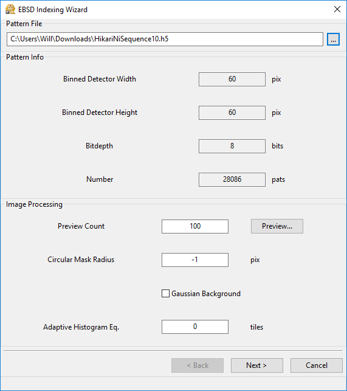
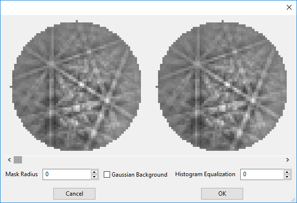
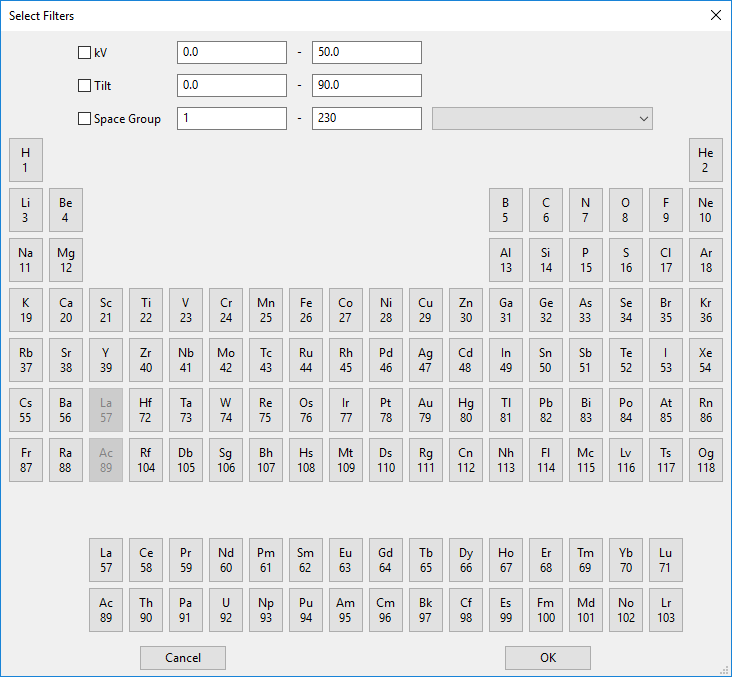
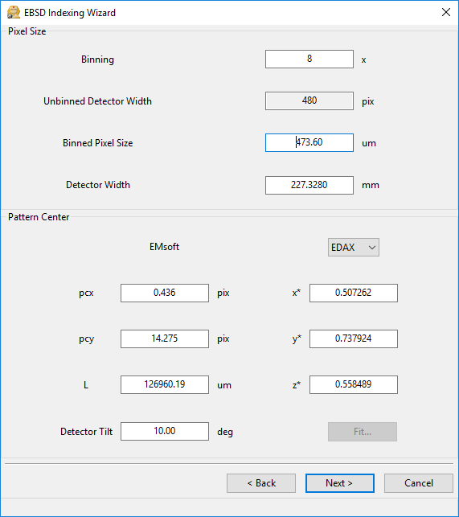
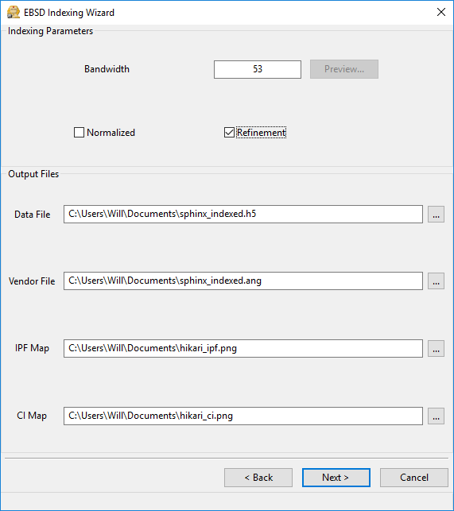
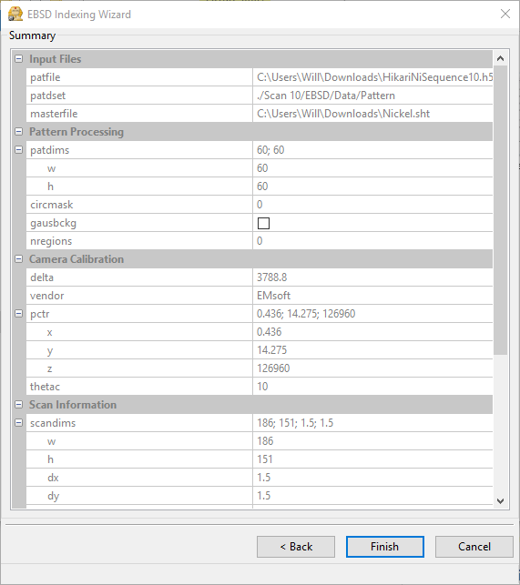
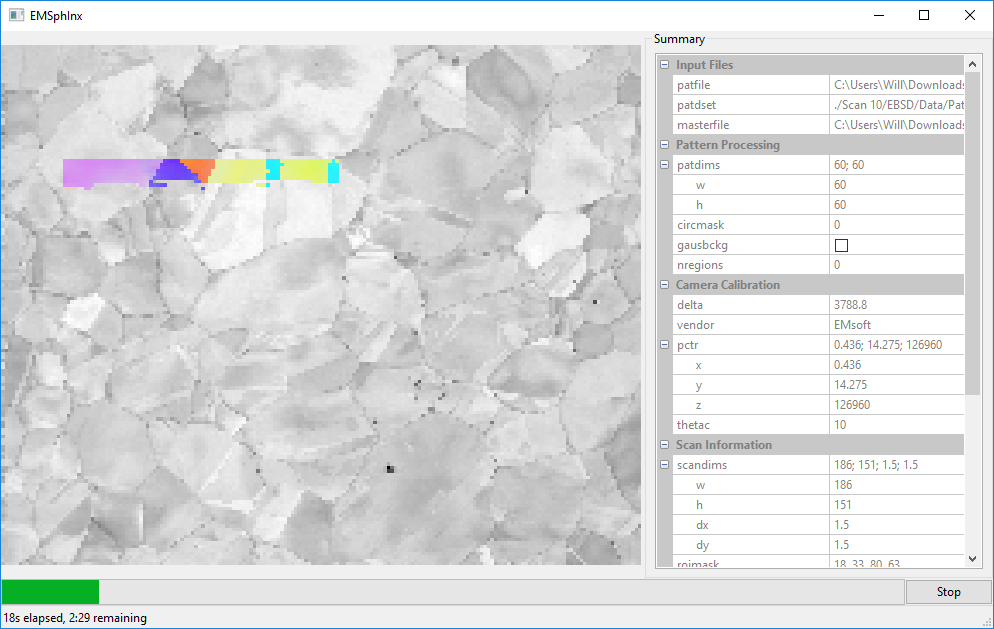

# EMSphInxEBSD wizard

The EBSD namelist generation wizard *EMSphInxEBSD.app* has 6 panels:

1. Experimental Pattern Selection
2. Master Pattern Selection
3. Detector Geometry
4. Scan Geometry
5. Indexing Parameters
6. Summary

Any error messages are displayed in the status bar (bottom left)

## Experimental Pattern Selection

  1. Load a pattern file with the "..."" button); the pattern dimensions, pixel type, and number of patterns will be displayed in the *Pattern Info* box. Additional scan information will be loaded if the pattern file is
    * an HDF5 file with an EBSD scan (standard across vendors)
    * a *.up1 or *.up2 file accompanied by an *.ang file with the same name
    * an *.ebsp file accomanied by a *.ctf file with the same name 
  2. Select a number of patterns to load (evenly spaced) and configure patterns with the *Preview...* button.
   * Mask Radius - mask for circular detectors
     * -1 - no circular mask
     * 0 - largest inscribed circle
     * &gt;0 - specify circular mask radius in pixels
   * Gaussian Background - fit a 2D Gaussian background to each pattern
   * Histogram Equalization - number of adaptive histogram tiles
     * 0 - no histogram equalization
     * 1 - regular (not adaptive) histogram equalization
     * &gt;1 - number of AHE tiles

## Master Pattern Selection

   
Patterns to be indexed are shown in the top half with available patterns in the bottom half. Double click master patterns to move them between the 2 boxes (or [un]tick the checkbox on OS X and Linux) Use the up/down arrows to re-order patterns for multi phase indexing (choose phase 0, 1, 2, ...). The file browse button (center right) adds individual master patterns to the indexing list and the folder browse button (bottom right) adds all master pattern files in the selected directory (recursively) to the library. Use the delete button (bottom left) to remove patterns from the library and the search button (bottom left) to filter the library display. The search bar filters files using the file name (full path, case insensitive).

## Detector Geometry

  1. Update the binning factor used to collect the experimental patterns, the corresponding unbinned detector size (in pixels) will be shown.
  2. Specify the pixel size for the current binning factor (generally ~60 um) or the full size of the detector (generally ~30 mm).
  3. Input the pattern center using the selected convention (or verify the center loaded from a scan file on the first page).
  4. Optionally refine the pattern center with the *fit...* button (not yet implemented in this version of the wizard).

## Scan Geometry

  1. Specify the scan and pixel width/height (or verify values loaded from a scan file).
  2. Optionally select a region of interest using the *Select ROI...* button. The image used for selection is determined by the drop down menu.

## Indexing Parameters

  1. Specify the bandwidth to use for indexing. Computation time scales as bw^3 * ln(bw^3) so choose the smallest tolerable value. For optimal efficiency 2*bw-1 should be a product of small primes. Some reasonable values are {53, 63, 68, 74, 88, 95, 113, 122, 123, 158}, but any size will be zero padded to next product of small primes so all sizes are nearly equivalently efficient in practice. (preview functionality is not yet implemented)
  2. Select normalized or unnormalized cross correlation and if orientation refinement should be applied.
  3. Select output files
    * Data File - HDF5 file to write output to (required)
    * Vendor File - *.ang or *.ctf output (optional)
    * IPF Map - {0,0,1} reference direction (optional)
    * CI Map - cross correlation map (optional)
 

## Summary Panel

   1. A read only summary of selected parameters is shown. Return to previous pages to edit any values if needed.
   2. When you're satisfied with the parameters, click finish:

    * Index Now - index with gui
    * Export Namelist - generate a namelist file to use with the command line program
    * Cancel - return to summary panel

# Indexing View

* Parameters can be edited while not indexing (but are not validated)

# Example Data

The full 10 scan sequence used in the indexing paper [can be downloaded here](https://kilthub.cmu.edu/ndownloader/files/14503052). The entire sequence is ~600 MB, a smaller file (~80 MB) containing only scan 10 is [also available](http://vbff.materials.cmu.edu/wp-content/uploads/2019/10/Hikari_Scan10.zip). A nickel master pattern corresponding to the scan conditions is in this repo (data/Nickel.sht).

Reasonable selections to walk through the hikari dataset (only non-default values listed):

1. Experimental Pattern Selection
  * Pattern File - HikariNiSequence.h5: Scan 10
  * Circular Mask Radius - 0
2. Master Pattern Selection
  * Nickel.sht
3. Detector Geometry
  * binning - 1 
  * pixel size - 475
4. Scan Geometry
5. Indexing Parameters
  * bandwidth - 53
  * refine - true
6. Summary Panel
  * choose index now for your first run, after you're comfortable with the gui you can try generating a namelist and indexing with the command line IndexEBSD program

